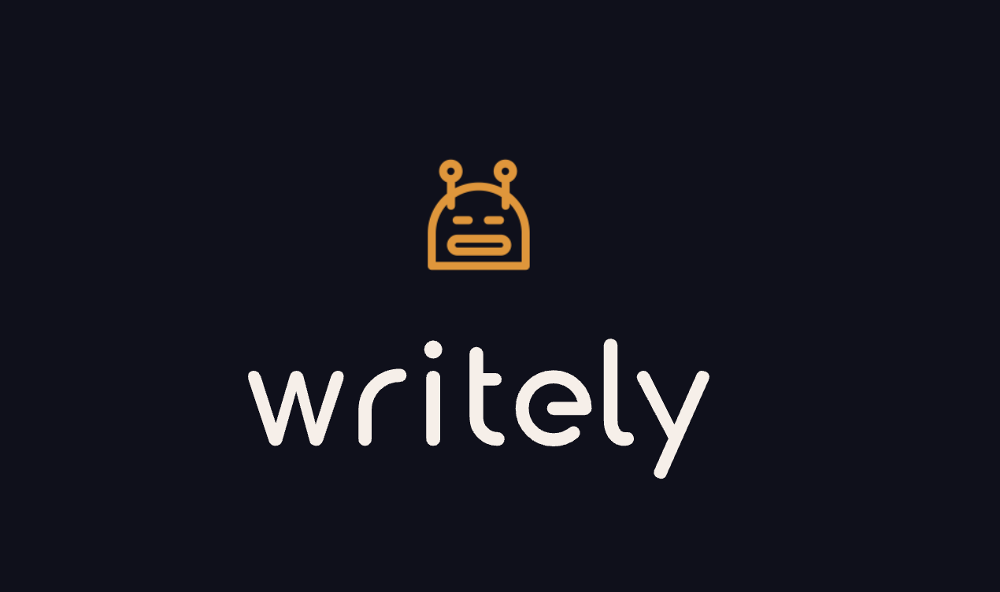

# Writely (Beta)
> 将 Notion AI 的能力带到任何地方 

 

[English Version](README.md) 

## 特性
1.🔥 基于 Open AI GPT 模型，带来了全新的智能写作体验。

2.✍️ 支持在互联网上的任何编辑器网页上进行写作辅助，有效提高用户的写作效率和质量。

3.📖 该产品可以执行查询翻译和阅读辅助功能，大大减少用户的阅读时间并提高理解能力。

## 使用方法 
### 安装
1. 转到 [release](https://github.com/anc95/writely/releases) 下载 Zip 包并解压缩。
2. 打开浏览器并转到 chrome://extensions/。 
3. 确保右上角的开发者模式已启用。
4. 在左上角单击“Load unpacked”并记载步骤 1 中解压的文件夹。

### 配置
1. 获取 Open AI API Key。 如果您没有，请在 https://platform.openai.com/account/api-keys 上进行申请。 
2. 单击插件图标，然后单击“设置”图标。

3. 进行配置。

4. 将鼠标滑动到任何网页上的单词上，一个“W”图标将出现在鼠标附近，单击以使用。

 

## 更多演示 

[演示文档](./DEMO.md)
