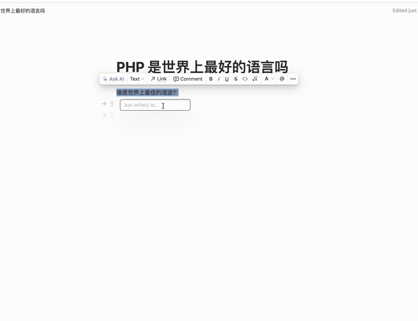

# Writely (Beta)

> Bring the power like Notion AI to everywhere

## 特点
1.🔥 基于 Open AI GPT 模型，带来全新的智能写作体验，。

2.✍️ 支持全网任何编辑器网页上进行写作辅助，有效提升用户的写作效率和质量。

3.📖 本产品可以进行查询翻译和辅助阅读，大大减少用户的阅读时间和提升理解能力。

## 使用

### 安装
1. 前往 [release](https://github.com/anc95/writely/releases/tag/v0.0.1) 下载 Zip 安装包，并解压
2. 浏览器打开 chrome://extensions/
3. 确保右上角开发者模式已开启
4. 点击左上角的 `Load Unpacked` 加载步骤1中的文件夹

### 配置

1. 有一个 Open AI 的 API Key，若无，请去 https://platform.openai.com/account/api-keys 申请

2. 点击插件 icon，点击 `设置` 图标

3. 进行配置

## Demo

## 知乎
https://user-images.githubusercontent.com/13167934/223768368-99711deb-db46-4c5e-9d26-26c7cb2b7276.mov

### 飞书 (Feishu)

### Notion

